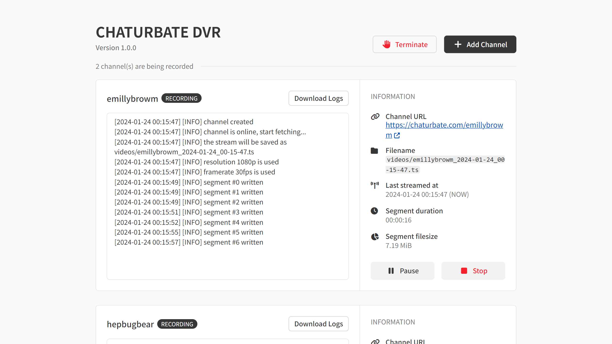
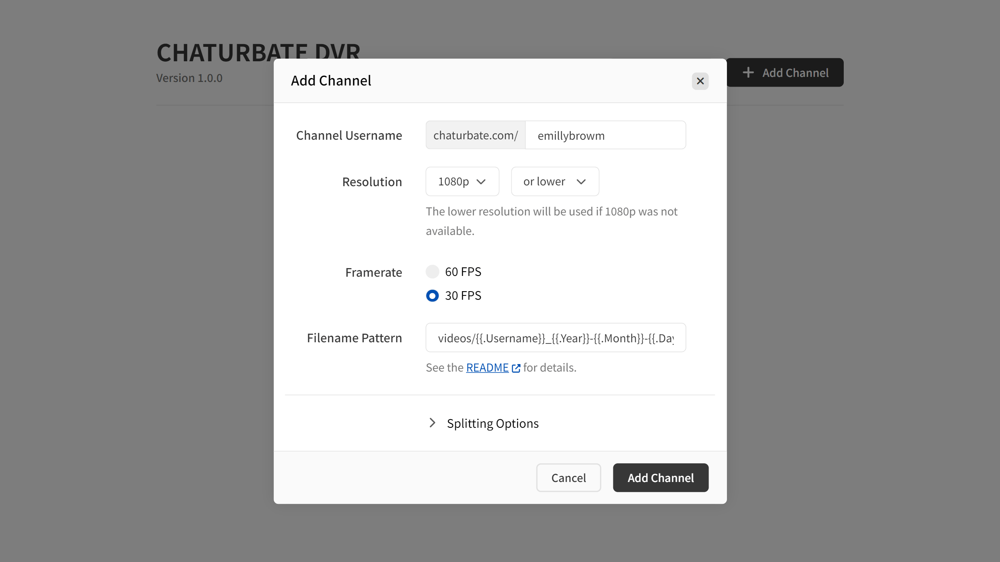

# Chaturbate DVR

The program records Chaturbate stream, supports 32-bit/64-bit Windows, macOS, Linux (or ARM), comes with a Web UI.

※ **[DMCA WARNING](https://www.dmca.com/)**: Contents on Chaturbate are copyrighted, you should not copy, share, distribute the content.

## Hello




```
$ ./chaturbate-dvr -u emillybrowm start

 ██████╗██╗  ██╗ █████╗ ████████╗██╗   ██╗██████╗ ██████╗  █████╗ ████████╗███████╗
██╔════╝██║  ██║██╔══██╗╚══██╔══╝██║   ██║██╔══██╗██╔══██╗██╔══██╗╚══██╔══╝██╔════╝
██║     ███████║███████║   ██║   ██║   ██║██████╔╝██████╔╝███████║   ██║   █████╗
██║     ██╔══██║██╔══██║   ██║   ██║   ██║██╔══██╗██╔══██╗██╔══██║   ██║   ██╔══╝
╚██████╗██║  ██║██║  ██║   ██║   ╚██████╔╝██║  ██║██████╔╝██║  ██║   ██║   ███████╗
 ╚═════╝╚═╝  ╚═╝╚═╝  ╚═╝   ╚═╝    ╚═════╝ ╚═╝  ╚═╝╚═════╝ ╚═╝  ╚═╝   ╚═╝   ╚══════╝
██████╗ ██╗   ██╗██████╗
██╔══██╗██║   ██║██╔══██╗
██║  ██║██║   ██║██████╔╝
██║  ██║╚██╗ ██╔╝██╔══██╗
██████╔╝ ╚████╔╝ ██║  ██║
╚═════╝   ╚═══╝  ╚═╝  ╚═╝
[2024-01-24 00:11:54] [INFO] [emillybrowm] channel created
[2024-01-24 00:11:55] [INFO] [emillybrowm] channel is online, start fetching...
[2024-01-24 00:11:55] [INFO] [emillybrowm] the stream will be saved as videos/emillybrowm_2024-01-24_00-11-55.ts
[2024-01-24 00:11:55] [INFO] [emillybrowm] resolution 1080p is used
[2024-01-24 00:11:55] [INFO] [emillybrowm] framerate 30fps is used
[2024-01-24 00:11:57] [INFO] [emillybrowm] segment #0 written
[2024-01-24 00:11:57] [INFO] [emillybrowm] segment #1 written
[2024-01-24 00:11:57] [INFO] [emillybrowm] segment #2 written
```

&nbsp;

## Usage

Start the program also enables the Web UI. Visit [`http://localhost:8080`](http://localhost:8080) to use the Web UI to manage channels.

```yaml
# Windows
$ chaturbate-dvr.exe start

# macOS or Linux
$ chaturbate-dvr start
```

&nbsp;

**💻 or... Run as a command-line tool**

Run the program with a channel name (`-u CHANNEL_USERNAME`) records the channel immediately, and the Web UI will be disabled.

```yaml
$ chaturbate-dvr -u CHANNEL_USERNAME start
```

&nbsp;

## Help

```bash
$ chaturbate-dvr -h

NAME:
   chaturbate-dvr - Records your favorite Chaturbate stream 😎🫵

USAGE:
   chaturbate-dvr [global options] command [command options]

VERSION:
   1.0.0

COMMANDS:
   start
   help, h  Shows a list of commands or help for one command

GLOBAL OPTIONS:
   --username value, -u value               channel username to record.
   --framerate value, -f value              preferred framerate. (default: 30)
   --resolution value, -r value             preferred resolution (default: 1080)
   --resolution-fallback value, --rf value  fallback to 'up' (larger) or 'down' (smaller) resolution if preferred resolution is not available (default: "down")
   --filename-pattern value, --fp value     filename pattern for videos (default: "videos/{{.Username}}_{{.Year}}-{{.Month}}-{{.Day}}_{{.Hour}}-{{.Minute}}-{{.Second}}{{if .Sequence}}_{{.Sequence}}{{end}}")
   --split-duration value, --sd value       minutes to split each video into segments ('0' to disable) (default: 0)
   --split-filesize value, --sf value       size in MB to split each video into segments ('0' to disable) (default: 0)
   --log-level value                        log level, availables: 'DEBUG', 'INFO', 'WARN', 'ERROR' (default: "INFO")
   --port value                             port to expose the web interface and API (default: "8080")
   --help, -h                               show help
   --version, -v                            print the version
```

**Examples**:

```yaml
# Records in 720p/60fps
$ chaturbate-dvr -u yamiodymel -f 60 -r 720 start

# Split the video every 30 minutes
$ chaturbate-dvr -u yamiodymel -sd 30 start

# Split the video every 1024 MB
$ chaturbate-dvr -u yamiodymel -sf 1024 start

# Change output filename pattern
$ chaturbate-dvr -u yamiodymel -fp video/{{.Username}}/{{.Year}}-{{.Month}}-{{.Day}}_{{.Hour}}-{{.Minute}}-{{.Second}}_{{.Sequence}} start
```

※ If the `-u CHANNEL_NAME` flag was not specified, the settings will be default settings for Web UI to create channels.

&nbsp;

## 📺 Framerate & Resolution / Fallback

Fallback indicates what to do when there's no expected target resolution, imagine the situation:

```
Availables: 1080p, 720p, 240p

Resolution: 480p (fallback setted to: up)
    Result: 720p will be used

Resolution: 480p (fallback setted to: down)
    Result: 240p will be used
```

&nbsp;

## 📄 Filename Pattern

The format is based on [Go Template Syntax](https://pkg.go.dev/text/template), available variables are:

`{{.Username}}`, `{{.Year}}`, `{{.Month}}`, `{{.Day}}`, `{{.Hour}}`, `{{.Minute}}`, `{{.Second}}`, `{{.Sequence}}`

&nbsp;

Default it hides the sequence if it's zero.

```
Pattern: {{.Username}}_{{.Year}}-{{.Month}}-{{.Day}}_{{.Hour}}-{{.Minute}}-{{.Second}}{{if .Sequence}}_{{.Sequence}}{{end}}
 Output: yamiodymel_2024-01-02_13-45-00.ts    # Sequence won't be shown if it's zero.
 Output: yamiodymel_2024-01-02_13-45-00_1.ts
```

**👀 or... The sequence can be shown even if it's zero.**

```
Pattern: {{.Username}}_{{.Year}}-{{.Month}}-{{.Day}}_{{.Hour}}-{{.Minute}}-{{.Second}}_{{.Sequence}}
 Output: yamiodymel_2024-01-02_13-45-00_0.ts
 Output: yamiodymel_2024-01-02_13-45-00_1.ts
```

**📁 or... Folder per each channel.**

```
Pattern: video/{{.Username}}/{{.Year}}-{{.Month}}-{{.Day}}_{{.Hour}}-{{.Minute}}-{{.Second}}_{{.Sequence}}
 Output: video/yamiodymel/2024-01-02_13-45-00_0.ts
```

※ The file will be saved as `.ts` format and it's not configurable.
